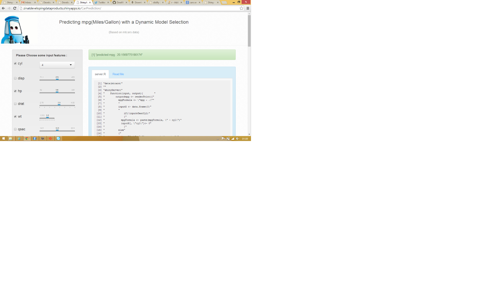

## Outline

This is an application developed for the Course Project of Coursera's 'Developing Data Products' course. The application is created using RStudio's Shiny library. 

The application incorporates a basic prediction algorithm the internals of which are explained in a later slide.

It depicts interactive user experience where the user gets to select parameters from different ranges. The application then plugs the chosen values in a basic prediction model and displays the outcome to the user.

The application is is hosted on the shiny server. Please feel free to check it out at the URL http://zinatdevelopingdataproducts.shinyapps.io/CarPrediction/.

The source code and all resources are available at the github URL https://github.com/ZinatWali/DDP. 

--- .class #id 

## Data Source 

The application works with RStudio's mtcars dataset. This is a small dataset as depicted by the following investigation.

```{r}
dim(mtcars)
paste(names(mtcars))
```


--- .class #id

## Application Structure

The prediction algorithm is implemented in server.R file. 

Index.html takes all the user inputs and displays the output generated by the server. It controls the UI layout supported by all the stylesheets and javascript files added to the containing directory.

All the input ranges are taken from the mtcars dataset. But in future, it can be a good extension to keep mtcars as just the training set and take open inputs.



--- .class #id


## Underlying Algorithm
in server.R, it is checked which features were selected by the user. All the selected features are then included in the model as predictors. The mtcars data is fitted to the resulting model. An example scenerio where all the features except for am and vs are selected for parameters would lead to the following calculation.

```{r}
fit <- lm(mpg ~ . - am - vs, data = mtcars)
```

The feature values are read from the input for selected feature variables. They are then plugged in the model to predict the value of mpg is the chosen settings.

```{r eval=FALSE}
predict(fit, newX)
```

where newX is the input data frame created from user's selected parameters values. The features that are not chosen are taken as zero values. 

A good future addition to this would be to display a plot of residual errors or a measure of confidence level. That would give the user an idea of how the feature set is performing.

--- .class #id